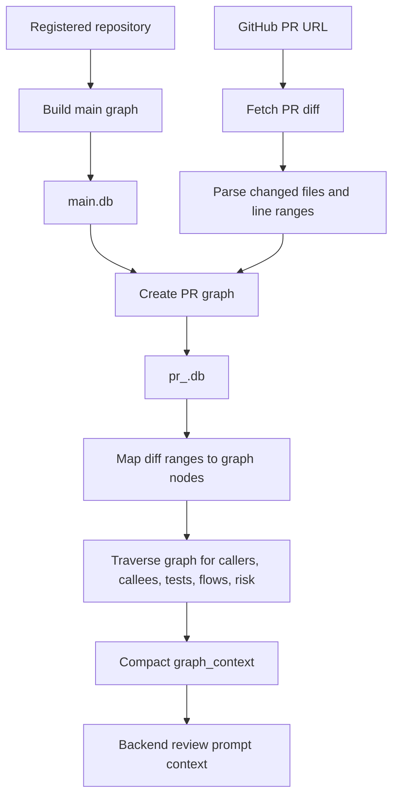

# Code Graph Build and PR Context Flow

This document explains how the extension builds code graphs, what graph nodes
and edges mean, how a PR diff is mapped into graph context, and how PR-specific
graphs are updated.

## High-Level Flow



## Graph Storage

The extension stores graph databases through `extension/graph_manager/lifecycle.py`.

Default layout:

```text
CRG_GRAPH_BASE/
  {owner}/
    {repo}/
      main.db
      pr_{number}.db
```

`main.db` is the cached graph for the registered repository's baseline branch.
`pr_{number}.db` is a temporary PR-specific graph created by copying `main.db`
and applying an incremental update from the PR checkout.

## Building the Main Graph

Main graph build is triggered by:

```text
POST /api/build-main
```

The extension calls:

```python
full_build(repo_root, GraphStore(main_db))
```

The build process:

1. Collect supported source files under the repository root.
2. Ignore generated/vendor/cache/build folders using default ignore patterns and
   optional `.code-review-graphignore`.
3. Parse files with `code_review_graph.parser.CodeParser`.
4. Extract structural nodes and dependency edges.
5. Store all data in SQLite through `GraphStore`.
6. Run best-effort post-resolvers for some languages/frameworks, such as
   ReScript, Spring DI, and Temporal Java call resolution.

`full_build` is a full parse of the repository. It is more expensive than PR
updates, but it is intended to be reused across many PR reviews.

## What Is a Node?

A node is a code entity stored in the `nodes` table. The core schema includes:

```text
kind
name
qualified_name
file_path
line_start
line_end
language
parent_name
params
return_type
is_test
file_hash
extra
```

Common node kinds:

| Kind | Meaning |
| --- | --- |
| `File` | A source file tracked by the graph. |
| `Class` | A class, module, component, or similar type-level construct. |
| `Function` | A function, method, procedure, resolver, handler, or callable unit. |
| `Type` | A type/interface/struct-like declaration where supported. |
| `Test` | A test function or test case detected by parser heuristics. |

`qualified_name` is the stable graph identifier. For file nodes it is the file
path. For code entities it is typically:

```text
{file_path}::{name}
{file_path}::{parent_name}.{name}
```

Line ranges (`line_start`, `line_end`) are important because PR diff hunks are
mapped back to the graph by line overlap.

## What Is an Edge?

An edge is a directed relationship stored in the `edges` table. The core schema
includes:

```text
kind
source_qualified
target_qualified
file_path
line
confidence
confidence_tier
extra
```

Common edge kinds:

| Kind | Direction | Meaning |
| --- | --- | --- |
| `CONTAINS` | parent -> child | File/class/module contains a function, method, class, or test. |
| `CALLS` | caller -> callee | A function/method invokes another callable. |
| `IMPORTS_FROM` | importer -> imported target | A file or symbol imports from another file/module/package. |
| `INHERITS` | subclass -> base | A class extends another class. |
| `IMPLEMENTS` | implementer -> interface | A class/type implements an interface/protocol. |
| `TESTED_BY` | test -> production node | A test covers or calls a production node. |
| `DEPENDS_ON` | source -> dependency | A broader dependency relationship. |
| `REFERENCES` | source -> referenced symbol | A function-as-value, callback, export, or other non-call reference. |

Edges are what allow the system to move from "this line changed" to "these
callers, callees, tests, flows, and risk areas are relevant."

## Building or Updating a PR Graph

PR graph build is triggered either explicitly:

```text
POST /api/build-pr
```

or automatically during:

```text
POST /api/review
POST /api/review/stream
```

The extension flow is:

1. Check that `main.db` exists.
2. Copy `main.db` to `pr_{number}.db`.
3. Prepare a temporary PR worktree checked out to the PR head.
4. Fetch the changed file list from GitHub.
5. Run:

```python
incremental_update(
    repo_root=pr_worktree_or_repo_root,
    store=GraphStore(pr_db),
    changed_files=changed_files,
)
```

`incremental_update` does not rebuild the whole repo. It:

1. Starts from the changed files.
2. Finds dependent files from the existing graph, mainly files importing from or
   calling into changed files.
3. Combines changed files and dependent files.
4. Removes graph data for deleted files.
5. Re-parses only files whose hash changed or are impacted.
6. Atomically replaces per-file nodes and edges in `pr_{number}.db`.
7. Re-runs selected language/framework resolvers only when relevant files
   changed.

This gives the review a graph that reflects the PR state without paying the
cost of a full repository rebuild.

## Mapping a Diff to Graph Context

The extension uses `extension/graph_manager/enricher_new.py` to turn a PR diff
into compact graph context.

### Step 1: Parse Diff Files

The extension fetches the PR diff from GitHub and parses it into `DiffFile`
objects. Each file contains hunks and line-level additions/removals.

### Step 2: Extract Changed Ranges

For each changed file:

1. Deleted files are skipped.
2. Added line numbers are collected from hunks.
3. Adjacent line numbers are coalesced into ranges, for example:

```text
12, 13, 14, 20 -> [(12, 14), (20, 20)]
```

If no added lines are available, the hunk range is used as a fallback so the
graph can still find enclosing nodes.

### Step 3: Normalize File Paths

GitHub diffs use repo-relative POSIX paths, while the graph may store absolute
paths or Windows-style paths. The enricher tries:

```text
path
path with / replaced by \
path with \ replaced by /
path without leading ./
suffix match against graph file paths
```

The result is:

```python
normalized_files
normalized_ranges
```

where ranges are preserved under graph-native file paths.

### Step 4: Map Ranges to Nodes

The enricher calls:

```python
analyze_changes(
    store=GraphStore(pr_db),
    changed_files=normalized_files,
    changed_ranges=normalized_ranges,
)
```

`analyze_changes` maps changed line ranges to graph nodes by checking whether a
node's `[line_start, line_end]` overlaps any changed range.

Only code-level nodes are prioritized for review context:

```text
Function
Class
Test
```

If the main mapping returns no functions/classes, the extension has a fallback
that directly scans nodes in changed files and accepts exact overlap or a small
nearby line window.

## Graph Traversal for Review Context

After changed nodes are found, the system gathers nearby graph context.

For each changed function/class:

| Context | Traversal |
| --- | --- |
| Callers | Incoming `CALLS` edges targeting the changed node. |
| Callees | Outgoing `CALLS` edges from the changed node. |
| Tests | `TESTED_BY` coverage, plus one-hop transitive coverage through callees. |
| Related context | A compact caller/callee expansion from the first few changed nodes. |
| Affected flows | Flow analysis over graph paths involving changed files. |
| Test gaps | Changed non-test nodes with no `TESTED_BY` edge. |
| Review priorities | Changed nodes sorted by risk score. |

Risk scoring combines multiple graph signals:

- Flow participation.
- Cross-community callers.
- Test coverage gaps.
- Security-sensitive names.
- Caller count.

The final `graph_context` sent to the backend is intentionally compact:

```json
{
  "changed_functions": [
    {
      "name": "applyUpdates",
      "qualified_name": "...",
      "file": "packages/cli/src/utils/commentJson.ts",
      "line_start": 41,
      "line_end": 63,
      "risk_score": 0.4,
      "callers": [],
      "callees": [],
      "tests": [],
      "is_untested": true,
      "kind": "Function",
      "language": "typescript"
    }
  ],
  "affected_flows": [],
  "test_gaps": [],
  "overall_risk": 0.4,
  "review_priorities": [],
  "related_context": [],
  "changed_ranges": {}
}
```

## How Backend Uses the Graph Context

The backend does not query the graph database directly. The extension sends the
compact `graph_context` to:

```text
POST /api/v1/chat/stream
```

The backend still fetches and parses the PR diff itself. It builds a
`ReviewContext` containing:

- PR title and description.
- Raw and formatted diff.
- Per-file diff context.
- Primary language.
- The `graph_context` from the extension.

Each review agent receives both the diff and the graph context. This lets agents
reason beyond the changed lines, for example:

- Is the changed function called by risky code?
- Is it untested?
- Does it affect important flows?
- Are related callers/callees likely to break?

## Lifecycle After Review

By default, PR graph artifacts are temporary:

```text
CRG_CLEANUP_AFTER_REVIEW=true
CRG_KEEP_PR_GRAPH=false
CRG_KEEP_FAILED_PR_GRAPH=false
```

When cleanup is enabled, the extension removes:

```text
pr_{number}.db
pr_{number}.db-wal
pr_{number}.db-shm
pr_{number}.db-journal
temporary PR worktree
```

`main.db` remains as the reusable repository cache.

If a PR is merged and the system wants to promote that graph as the new
baseline, `GraphLifecycleManager.promote_pr_to_main` can replace `main.db` with
the PR graph.

## Summary

The graph system is designed around one stable baseline graph and short-lived PR
graphs:

1. `main.db` captures repository-wide structure.
2. `pr_{number}.db` starts as a copy of `main.db`.
3. Incremental update reparses only changed and impacted files.
4. Diff line ranges map changed hunks to graph nodes.
5. Graph traversal adds callers, callees, tests, flows, priorities, and risk.
6. The backend uses this compact context to produce graph-aware review findings.
