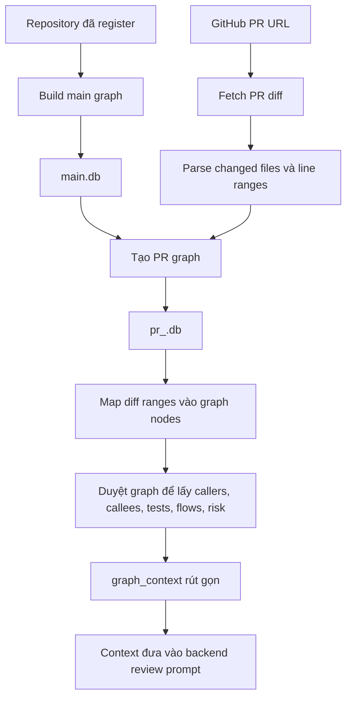

# Luồng Build Code Graph và Bổ Sung Context cho PR

Tài liệu này mô tả cách extension build code graph, node/cạnh trong graph là gì,
cách duyệt graph từ diff để cấp thêm context cho backend review, và cách update
graph riêng cho từng PR.

## Luồng Tổng Quan



## Lưu Trữ Graph

Extension quản lý graph database qua `extension/graph_manager/lifecycle.py`.

Layout mặc định:

```text
CRG_GRAPH_BASE/
  {owner}/
    {repo}/
      main.db
      pr_{number}.db
```

`main.db` là graph cache của baseline branch của repository.
`pr_{number}.db` là graph tạm cho từng PR, được tạo bằng cách copy `main.db`
rồi apply incremental update từ checkout của PR.

## Build Main Graph

Main graph được build qua endpoint:

```text
POST /api/build-main
```

Extension gọi:

```python
full_build(repo_root, GraphStore(main_db))
```

Quy trình build:

1. Thu thập các source file được hỗ trợ trong repository.
2. Bỏ qua thư mục generated/vendor/cache/build theo ignore pattern mặc định và
   `.code-review-graphignore` nếu có.
3. Parse file bằng `code_review_graph.parser.CodeParser`.
4. Trích xuất node cấu trúc code và edge quan hệ phụ thuộc.
5. Lưu tất cả vào SQLite qua `GraphStore`.
6. Chạy thêm các resolver best-effort cho một số ngôn ngữ/framework như
   ReScript, Spring DI, Temporal Java.

`full_build` parse toàn bộ repository nên tốn chi phí hơn PR update, nhưng kết
quả `main.db` được tái sử dụng cho nhiều lần review PR.

## Node Là Gì?

Node là một thực thể code được lưu trong bảng `nodes`. Schema chính gồm:

```text
kind
name
qualified_name
file_path
line_start
line_end
language
parent_name
params
return_type
is_test
file_hash
extra
```

Các loại node phổ biến:

| Kind | Ý nghĩa |
| --- | --- |
| `File` | Một source file được graph theo dõi. |
| `Class` | Class, module, component hoặc cấu trúc cấp type tương tự. |
| `Function` | Function, method, procedure, resolver, handler hoặc callable unit. |
| `Type` | Type/interface/struct-like declaration nếu parser hỗ trợ. |
| `Test` | Test function hoặc test case được nhận diện bằng heuristic parser. |

`qualified_name` là định danh ổn định của node trong graph. Với file node, nó là
file path. Với code entity, thường có dạng:

```text
{file_path}::{name}
{file_path}::{parent_name}.{name}
```

`line_start` và `line_end` rất quan trọng vì diff hunk của PR được map vào graph
bằng cách kiểm tra line range overlap.

## Edge Là Gì?

Edge là quan hệ có hướng giữa các node, được lưu trong bảng `edges`. Schema chính
gồm:

```text
kind
source_qualified
target_qualified
file_path
line
confidence
confidence_tier
extra
```

Các loại edge phổ biến:

| Kind | Hướng | Ý nghĩa |
| --- | --- | --- |
| `CONTAINS` | parent -> child | File/class/module chứa function, method, class hoặc test. |
| `CALLS` | caller -> callee | Function/method gọi một callable khác. |
| `IMPORTS_FROM` | importer -> imported target | File hoặc symbol import từ file/module/package khác. |
| `INHERITS` | subclass -> base | Class kế thừa class khác. |
| `IMPLEMENTS` | implementer -> interface | Class/type implement interface/protocol. |
| `TESTED_BY` | test -> production node | Test cover hoặc gọi production node. |
| `DEPENDS_ON` | source -> dependency | Quan hệ phụ thuộc tổng quát hơn. |
| `REFERENCES` | source -> referenced symbol | Callback, function-as-value, export hoặc reference không phải call trực tiếp. |

Edge là thành phần giúp hệ thống đi từ "dòng code này thay đổi" sang "caller,
callee, test, flow và vùng rủi ro nào liên quan".

## Ví Dụ Dễ Hiểu Về Node Và Edge

Có thể hiểu code graph như một bản đồ của codebase:

- Node là một thực thể trong code, ví dụ file, class, function hoặc test.
- Edge là quan hệ giữa các thực thể đó, ví dụ file chứa function, function A gọi
  function B, hoặc test kiểm thử function X.

Ví dụ:

```python
# app/user_service.py

from app.email import send_email

class UserService:
    def create_user(self, email):
        user = save_user(email)
        send_email(email)
        return user
```

```python
# tests/test_user_service.py

def test_create_user():
    service = UserService()
    user = service.create_user("a@example.com")
    assert user.email == "a@example.com"
```

Graph có thể biểu diễn thành:

```text
File app/user_service.py
  CONTAINS -> Class UserService
  CONTAINS -> Function UserService.create_user

Function UserService.create_user
  CALLS -> Function save_user
  CALLS -> Function send_email

File tests/test_user_service.py
  CONTAINS -> Test test_create_user

Test test_create_user
  TESTED_BY / covers -> Function UserService.create_user
```

Nếu PR sửa dòng trong `create_user`, hệ thống sẽ:

1. Map changed line trong diff vào node `Function UserService.create_user`.
2. Tìm các function gọi tới nó qua incoming `CALLS` edge.
3. Tìm các function nó gọi ra ngoài qua outgoing `CALLS` edge.
4. Tìm test liên quan qua `TESTED_BY`.
5. Nếu function quan trọng nhưng không có test, đưa vào `test_gaps`.
6. Kết hợp số caller, test coverage, affected flow và tên function để tính
   `risk_score`.

Ví dụ `graph_context` rút gọn:

```json
{
  "changed_functions": [
    {
      "name": "create_user",
      "file": "app/user_service.py",
      "line_start": 6,
      "line_end": 10,
      "callers": ["SignupAPI.post", "AdminController.register_user"],
      "callees": ["save_user", "send_email"],
      "tests": ["test_create_user"],
      "is_untested": false,
      "risk_score": 0.7
    }
  ]
}
```

Điểm khác biệt so với review chỉ nhìn diff:

```text
Diff-only: Dòng này bị sửa.
Graph-aware: Dòng này thuộc function nào, được ai gọi, gọi tới đâu,
có test cover không, ảnh hưởng flow nào, và rủi ro lan truyền rộng hay hẹp.
```

## Build hoặc Update PR Graph

PR graph có thể được build trực tiếp:

```text
POST /api/build-pr
```

hoặc tự động trong quá trình review:

```text
POST /api/review
POST /api/review/stream
```

Luồng của extension:

1. Kiểm tra `main.db` đã tồn tại.
2. Copy `main.db` thành `pr_{number}.db`.
3. Tạo temporary worktree checkout đúng PR head.
4. Fetch danh sách changed files từ GitHub.
5. Chạy:

```python
incremental_update(
    repo_root=pr_worktree_or_repo_root,
    store=GraphStore(pr_db),
    changed_files=changed_files,
)
```

`incremental_update` không rebuild toàn repo. Nó:

1. Bắt đầu từ các changed files.
2. Tìm dependent files từ graph hiện có, chủ yếu là file import hoặc gọi vào
   changed files.
3. Gộp changed files và dependent files.
4. Xóa graph data cho file đã bị delete.
5. Re-parse chỉ các file đổi hash hoặc bị ảnh hưởng.
6. Replace atomically nodes/edges theo từng file trong `pr_{number}.db`.
7. Chạy lại resolver theo ngôn ngữ/framework chỉ khi file liên quan thay đổi.

Cách này tạo graph phản ánh trạng thái PR mà không phải parse lại toàn bộ repo.

## Map Diff Vào Graph Context

Extension dùng `extension/graph_manager/enricher_new.py` để biến PR diff thành
`graph_context` rút gọn.

### Bước 1: Parse Diff Files

Extension fetch PR diff từ GitHub rồi parse thành các `DiffFile`. Mỗi `DiffFile`
có hunks và thông tin từng dòng add/remove/context.

### Bước 2: Lấy Changed Ranges

Với mỗi changed file:

1. Bỏ qua file bị delete.
2. Thu thập line number của các dòng được add trong hunk.
3. Gộp các line liền kề thành range, ví dụ:

```text
12, 13, 14, 20 -> [(12, 14), (20, 20)]
```

Nếu không lấy được added lines, hệ thống fallback sang hunk range để vẫn có thể
tìm enclosing node trong graph.

### Bước 3: Normalize File Path

GitHub diff dùng repo-relative POSIX path, còn graph có thể lưu absolute path
hoặc Windows-style path. Enricher thử các biến thể:

```text
path
path thay / bằng \
path thay \ bằng /
path bỏ ./ ở đầu
suffix match với graph file paths
```

Kết quả là:

```python
normalized_files
normalized_ranges
```

Trong đó ranges được giữ nguyên nhưng gắn với path đúng theo graph database.

### Bước 4: Map Ranges Sang Nodes

Enricher gọi:

```python
analyze_changes(
    store=GraphStore(pr_db),
    changed_files=normalized_files,
    changed_ranges=normalized_ranges,
)
```

`analyze_changes` tìm các graph node có `[line_start, line_end]` overlap với
changed range.

Các node được ưu tiên cho review context:

```text
Function
Class
Test
```

Nếu mapping chính không tìm được function/class, extension có fallback: scan
node trong changed files và chấp nhận exact overlap hoặc một line window gần đó.

## Duyệt Graph Để Lấy Review Context

Sau khi tìm được changed nodes, hệ thống lấy thêm context xung quanh graph.

Với mỗi changed function/class:

| Context | Cách duyệt |
| --- | --- |
| Callers | Incoming `CALLS` edges trỏ vào changed node. |
| Callees | Outgoing `CALLS` edges đi ra từ changed node. |
| Tests | `TESTED_BY` coverage, cộng thêm coverage gián tiếp một hop qua callees. |
| Related context | Mở rộng caller/callee rút gọn từ một số changed nodes đầu tiên. |
| Affected flows | Flow analysis trên graph paths liên quan tới changed files. |
| Test gaps | Changed non-test nodes không có `TESTED_BY` edge. |
| Review priorities | Changed nodes được sort theo risk score. |

Risk score kết hợp nhiều tín hiệu graph:

- Node tham gia flow quan trọng.
- Caller từ community khác.
- Thiếu test coverage.
- Tên function/class có dấu hiệu security-sensitive.
- Số lượng callers.

`graph_context` cuối cùng gửi sang backend được giữ nhỏ gọn:

```json
{
  "changed_functions": [
    {
      "name": "applyUpdates",
      "qualified_name": "...",
      "file": "packages/cli/src/utils/commentJson.ts",
      "line_start": 41,
      "line_end": 63,
      "risk_score": 0.4,
      "callers": [],
      "callees": [],
      "tests": [],
      "is_untested": true,
      "kind": "Function",
      "language": "typescript"
    }
  ],
  "affected_flows": [],
  "test_gaps": [],
  "overall_risk": 0.4,
  "review_priorities": [],
  "related_context": [],
  "changed_ranges": {}
}
```

## Backend Dùng Graph Context Như Thế Nào?

Backend không query graph database trực tiếp. Extension gửi `graph_context` rút
gọn tới:

```text
POST /api/v1/chat/stream
```

Backend vẫn tự fetch và parse PR diff. Sau đó backend build `ReviewContext` gồm:

- PR title và description.
- Raw diff và formatted diff.
- Diff context theo từng file.
- Primary language.
- `graph_context` do extension gửi.

Mỗi review agent nhận cả diff và graph context. Nhờ đó agent có thể reasoning
vượt ra ngoài changed lines, ví dụ:

- Function vừa đổi có caller quan trọng không?
- Function đó có test cover không?
- Thay đổi này ảnh hưởng flow nào?
- Caller/callee liên quan có thể bị break không?

## Vòng Đời Sau Review

Mặc định PR graph là artifact tạm:

```text
CRG_CLEANUP_AFTER_REVIEW=true
CRG_KEEP_PR_GRAPH=false
CRG_KEEP_FAILED_PR_GRAPH=false
```

Khi cleanup bật, extension xóa:

```text
pr_{number}.db
pr_{number}.db-wal
pr_{number}.db-shm
pr_{number}.db-journal
temporary PR worktree
```

`main.db` vẫn được giữ lại làm cache cấp repository.

Nếu PR đã merge và muốn dùng graph của PR làm baseline mới,
`GraphLifecycleManager.promote_pr_to_main` có thể replace `main.db` bằng PR
graph.

## Tóm Tắt

Graph system được thiết kế quanh một baseline graph ổn định và các PR graph tạm:

1. `main.db` lưu cấu trúc toàn repository.
2. `pr_{number}.db` bắt đầu bằng bản copy của `main.db`.
3. Incremental update chỉ re-parse changed files và impacted files.
4. Diff line ranges được map sang graph nodes.
5. Graph traversal bổ sung callers, callees, tests, flows, priorities và risk.
6. Backend dùng context rút gọn này để tạo review findings có hiểu biết về
   repo context.
